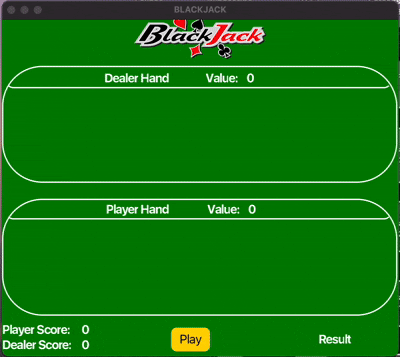
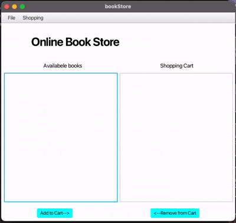
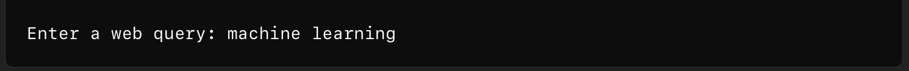
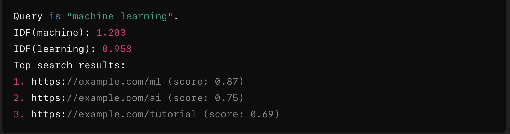

Damilola Williams | Software Developer & Curious Student/Learner & Problem Solver 

- 👋 Hi, I’m Damilola Williams
- 👀 I’m interested in Java, C, C++ and just learning new things
- 🌱 I’m currently learning pyhton
- 💞️ I’m looking to collaborate on innovative projects that challenge me
- 📫 How to reach me: damilolawilliams010@gmail.com
- 😄 Pronouns: He/Him
- ⚡ Fun fact: I love playing soccer and swimming

Welcome to my GitHub profile! I’m Damilola, a passionate Computer Science student at Purdue University, with a strong focus on software development, machine learning, and data systems. With proficiency in JavaScript, Python, Java, C++, and SQL, I work on projects that involve AI, web development, and real-time systems.

Key Projects 
Grading AI Development: Building an AI-powered system to automate the grading of student answer sheets using machine learning and NLP. 
Web Application Development: Developed an optimized browser algorithm in C, leveraging linked lists and binary tries for faster data retrieval. 
Digital Audio Workstation Plugins: Led a team to create custom audio plug-ins, using C++ and JUCE, focused on efficient real-time audio processing. 

Skills & Technologies 
Languages: JavaScript, Python, Java, C++, SQL 
Tools: Azure DevOps, Node.js, React, Git, Visual Studio Code 
Data: Data visualization and dashboard creation 
Machine Learning: Experience with PyTorch and NLP

 

 

 
<!---
DamilolaWilliams1/DamilolaWilliams1 is a ✨ special ✨ repository because its `README.md` (this file) appears on your GitHub profile.
You can click the Preview link to take a look at your changes.
--->
